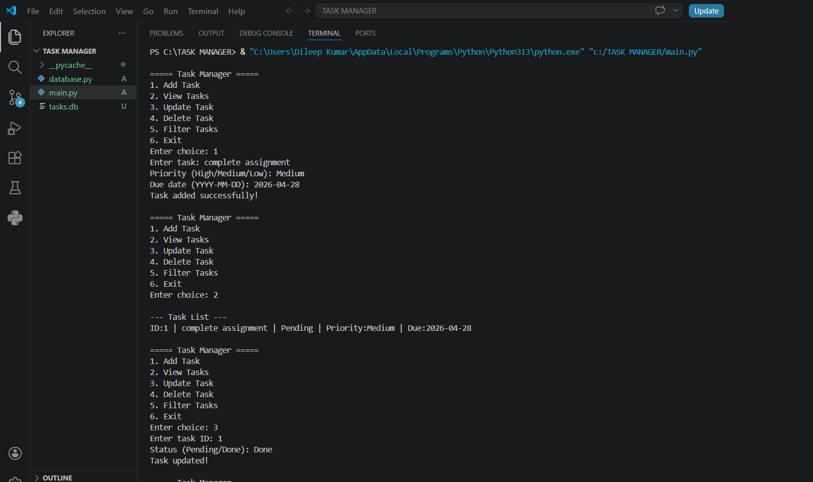

# Task Manager Application

A Python-based Task Manager application that helps users manage daily tasks efficiently using an SQLite database. The application allows users to perform core operations like adding, updating, deleting, and viewing tasks with additional features like priority levels and due dates.

---

## 🚀 Features

* Add new tasks
* View all tasks
* Update task status (Pending / Done)
* Delete tasks
* Filter tasks by status
* Assign priority (High / Medium / Low)
* Set due dates for tasks

---

## 🛠️ Technologies Used

* Python
* SQLite (Database)

---

## 📂 Project Structure

* `main.py` → Contains application logic and user interaction
* `database.py` → Handles database connection and table creation
* `screenshot.png` → Sample output of the application

---

## ▶️ How to Run

1. Clone the repository
2. Navigate to the project folder
3. Run the following command:

```
python main.py
```

---

## 📸 Sample Output




---

## 💡 Key Highlights

* Implemented CRUD operations using SQL queries
* Designed a modular structure for better code maintainability
* Ensured persistent data storage using SQLite

---

## 👨‍💻 Author

Dileep Kumar
🔗 GitHub: https://github.com/dileep1218
